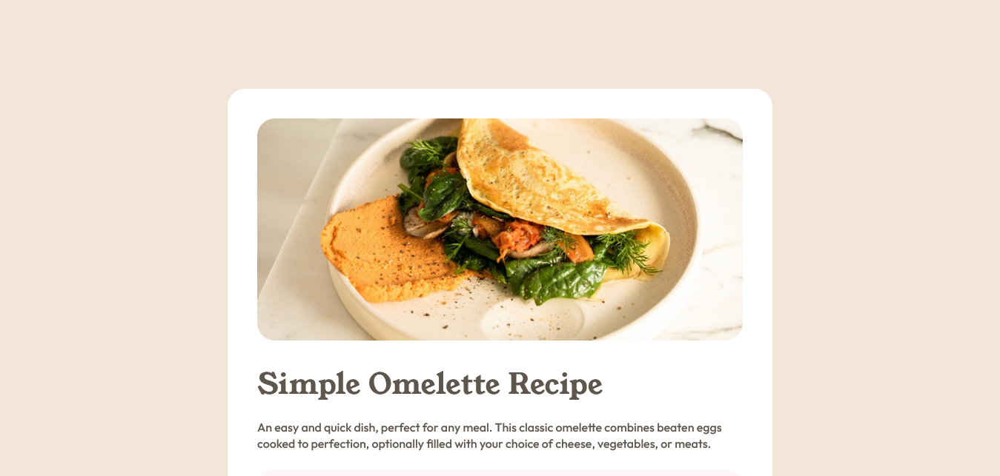

# Frontend Mentor - Recipe page solution

This is a solution to the [Recipe page challenge on Frontend Mentor](https://www.frontendmentor.io/challenges/recipe-page-KiTsR8QQKm). Frontend Mentor challenges help you improve your coding skills by building realistic projects.

## Table of contents

- [Overview](#overview)
  - [The challenge](#the-challenge)
  - [Screenshot](#screenshot)
  - [Links](#links)
- [My process](#my-process)
  - [Built with](#built-with)
  - [What I learned](#what-i-learned)
  - [Continued development](#continued-development)
  - [Useful resources](#useful-resources)
- [Author](#author)

## Overview

### Screenshot

### Links

- Solution URL: [Responsive Omelette Recipe Page](https://www.frontendmentor.io/solutions/responsive-omelette-recipe-page-built-with-html5-css3-and-aos-9r-VhEHBWh)
- Live Site URL: [Omelette Recipe Page](https://dinadess.github.io/recipe-page-fm/)

## My process

### Built with

- Semantic HTML5 markup
- CSS custom properties
- Flexbox
- Mobile-first workflow
- [AOS](https://michalsnik.github.io/aos/) - Anomate On Scroll library
- [Real Favicon Generator](https://realfavicongenerator.net/) - A free tool to generate your website's favicons

### What I learned

Use this section to recap over some of your major learnings while working through this project. Writing these out and providing code samples of areas you want to highlight is a great way to reinforce your own knowledge.

### Continued development

Use this section to outline areas that you want to continue focusing on in future projects. These could be concepts you're still not completely comfortable with or techniques you found useful that you want to refine and perfect.

### Useful resources

- [Smashing Magazine @font-face](https://www.smashingmagazine.com/2013/02/setting-weights-and-styles-at-font-face-declaration/) - This helped me for XYZ reason. I really liked this pattern and will use it going forward.
- [MDN @font-face](https://developer.mozilla.org/en-US/docs/Web/CSS/@font-face/font-display) - This is an amazing article which helped me finally understand XYZ. I'd recommend it to anyone still learning this concept.

## Author

- Frontend Mentor - [@dinadess](https://www.frontendmentor.io/profile/dinadess)
